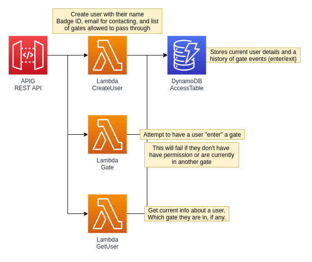

## Turnstile

API for a security turnstile, only allows a user to be in one zone at a time.



### Endpoints


1. Create a user

```json
{
    "id": "ID#123456",
    "name": "John Doe",
    "email": "test@test.com",
    "gates": ["GATE#1", "GATE#3", "GATE#4"]
}
```

2. User attempts to authenticate and pass through a gate (exit if the user has previously entered).
3. This fails if the `gate` id is not in the `gates` list for the user.
4. This fails if the user is currently in a different `gate`.

```json
{
    "id": "ID#123456",
    "gate": "GATE#3"
}
```


5. Get current details about the user, including the gate they are.
```json
{
    "id": "ID#123456"
}
```


